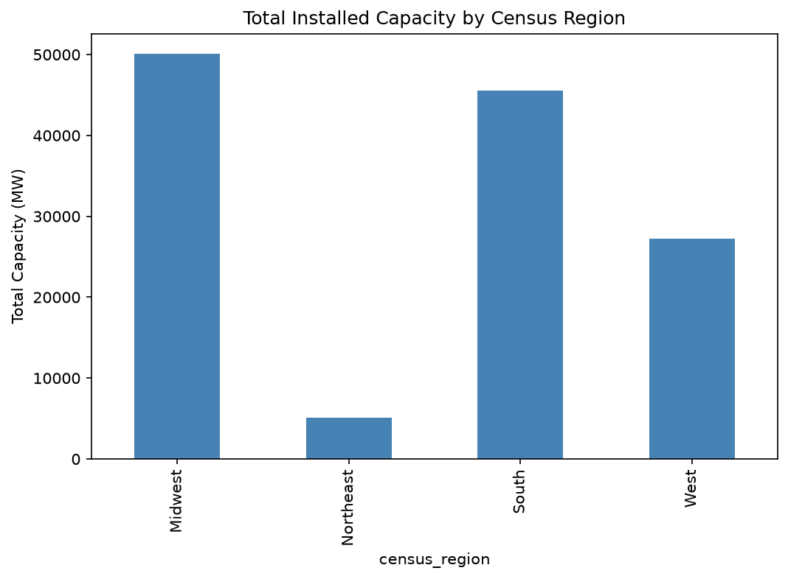
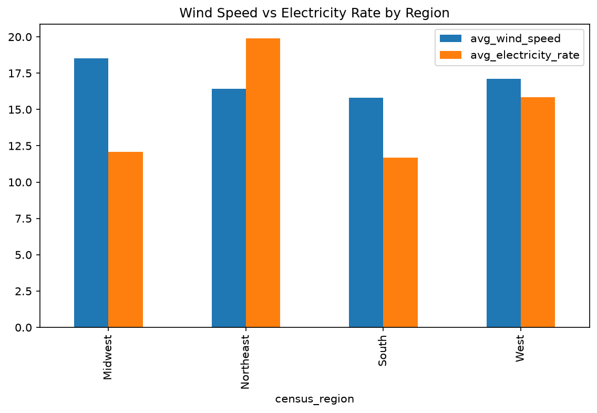
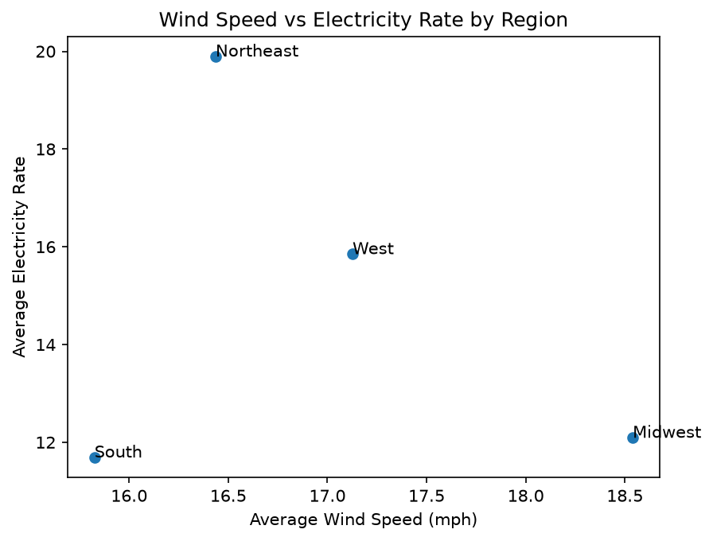

# Wind Turbine Investment Analysis: Identifying the Best U.S. Region for Renewable Energy Acquisitions

## Problem Statement

A private equity firm focused on renewable energy aims to acquire U.S. wind farms but requires deeper insight into the specific structural characteristics and geographic locations that drive peak energy efficiency. To guide these acquisitions, the Investment Committee must evaluate historical Net Generation (MWh) data across various Census Regions, segmented by turbine specifications and technical details. By spotting niche opportunities, distinguishing the physical configurations and regions with the strongest historical performance, the firm can strategically target assets that meet proven benchmarks for high energy output.

## Core Analytical Objectives

* Which Census Region has the most installed wind capacity and highest estimated Net Generation?
* How do physical turbine specifications (like rotor diameter and hub height) impact energy output?
* Is there a trade-off between regional wind speeds and local electricity rates?
* Overall, which region and turbine design represent the best target for a new investment?
   
## Executive Summary

This project analyzes over 65,000 wind turbines across the contiguous United States, using the U.S. Wind Turbine Database combined with state-level wind speed and electricity pricing data. Since direct energy production (Net Generation) data was not available for this dataset, installed turbine capacity was used as a proxy for production potential, paired with regional wind speed as an indicator of production efficiency and electricity rates as an indicator of revenue potential.

Turbines were grouped into the four U.S. Census Regions (Northeast, Midwest, South, West) and compared across installed capacity, turbine specifications, average wind speed, and average electricity rate. The data cleaning process addressed missing turbine specification values (dropped, since they represent real physical measurements that cannot be reliably estimated), inconsistent state name formats between datasets, and a comma-formatting bug in the electricity billing data that was initially misread as missing data for Hawaii.

The analysis found that the **Midwest** has both the largest total installed wind capacity (~50,100 MW) and the strongest average wind speed (18.6 mph) of any region, while its electricity rate, though not the highest, remains reasonable. The **Northeast** commands the highest electricity rate by a wide margin but has the weakest wind resource and by far the smallest turbine footprint. The **South** has substantial existing capacity but currently ranks lowest on both wind speed and electricity rate. The **West** is comparatively balanced but has the smallest average turbine size. Based on this combination of factors, the Midwest is recommended as the strongest region for new wind farm investment, with the Northeast worth considering only as a smaller, niche opportunity.

## File Directory

| File / Folder | Description |
| :--- | :--- |
| `README.md` | This file — project overview, summary, and findings. |
| `Data/wind-turbines.csv` | Original turbine-level dataset (U.S. Wind Turbine Database). |
| `Data/windiest-states-in-the-us_-2025.csv` | Original state-level average wind speed data. |
| `Data/average_electricity_rates.csv` | Original state-level average electricity rates. |
| `Data/average_electricity_bills.csv` | Original state-level average electricity bills. |
| `Data/wind_turbines_clean.csv` | Final cleaned and merged dataset used for analysis. |
| `Code/01_Data_Cleaning.ipynb` | Data loading, cleaning, and merging of all four source files. |
| `Code/02_EDA.ipynb` | Exploratory analysis, regional aggregation, and visualizations. |
| `Presentation/Wind_Turbine_Investment_Analysis.pdf` | Final presentation slides. |

*(Note: adjust the file/folder names above to exactly match your repository if they differ.)*

## Data & Data Dictionary

Data sources:
- **Wind turbine specifications and locations**: U.S. Wind Turbine Database (USWTDB), maintained by USGS/LBNL/AWEA.
- **State-level wind speed**: Windiest States dataset (2025).
- **State-level electricity rates and bills**: average electricity rate/bill datasets by state.

Key columns in the final cleaned dataset:

| Feature / Column | Data Type | Source | Description |
| :--- | :--- | :--- | :--- |
| case_id | int | Original | Unique stable ID for each turbine |
| t_state | string | Original | State where the turbine is located (2-letter code) |
| t_county | string | Original | County where the turbine is located |
| p_name | string | Original | Name of the wind power project |
| p_year | float | Original | Year the turbine became operational |
| p_tnum | int | Original | Number of turbines in the project |
| p_cap | float | Original | Total cumulative capacity of the project (MW) |
| t_manu | string | Original (cleaned) | Turbine manufacturer (duplicate names merged, e.g. Gamesa → Siemens) |
| t_model | string | Original | Turbine model name |
| t_cap | float | Original | Turbine rated capacity (kW) |
| t_hh | float | Original | Turbine hub height (m) |
| t_rd | float | Original | Turbine rotor diameter (m) |
| t_rsa | float | Original | Turbine rotor swept area (m²) |
| t_ttlh | float | Original | Total turbine height, ground to blade tip (m) |
| xlong / ylat | float | Original | Turbine longitude / latitude |
| **census_region** | string | Engineered | US Census Bureau region (Northeast/Midwest/South/West), mapped from t_state |
| **t_cap_mw** | float | Engineered | Turbine capacity converted from kW to MW (t_cap / 1000) |
| avg_wind_speed_mph | float | Merged | Average wind speed for the turbine's state |
| rate_average | float | Merged | Average electricity rate for the turbine's state (cents/kWh) |
| bill_average | float | Merged, cleaned | Average monthly electricity bill for the turbine's state ($) |

## Conclusions & Recommendations

- **Prioritize the Midwest** for new wind farm investment — it combines the strongest wind resource with an already large, established market.
- **Consider the Northeast** as a smaller, secondary opportunity, since its high electricity prices could offset its weaker wind resource for a smaller-scale project.
- **Deprioritize the South and West** for new investment based on current wind speed and electricity rate data, though the South's existing infrastructure may still support expansion of current projects.

## Areas for Further Research

- Actual energy production data (Net Generation in MWh) was not available, so installed turbine capacity was used as a stand-in measure. Incorporating real generation data (e.g., EIA-923) would allow a more direct efficiency comparison.
- Electricity rates used are retail/consumer prices, not necessarily the wholesale/PPA price a wind farm would actually be paid for its electricity.
- This analysis compared whole Census Regions — looking at individual states or counties could reveal more specific and precise investment locations.

## Sources

- **Wind Turbine Data**: U.S. Wind Turbine Database (USWTDB) — https://emp.lbl.gov/publications/us-wind-turbine-database-files
- **Windiest States Data (2025)**: Provided as part of course project materials.
- **Electricity Rates Data**: Provided as part of course project materials.
- **Electricity Bills Data**: Provided as part of course project materials.

## Key Visualizations

1. **Total Installed Capacity by Census Region** — bar chart showing the Midwest and South lead in existing installed wind capacity.
2. **Average Wind Speed vs. Average Electricity Rate by Region** — bar chart revealing the trade-off between wind strength and electricity pricing.
3. **Wind Speed vs. Electricity Rate (Combined View)** — scatter plot visually confirming that no single region leads on both factors, with the Midwest strongest on wind and the Northeast strongest on price.

 